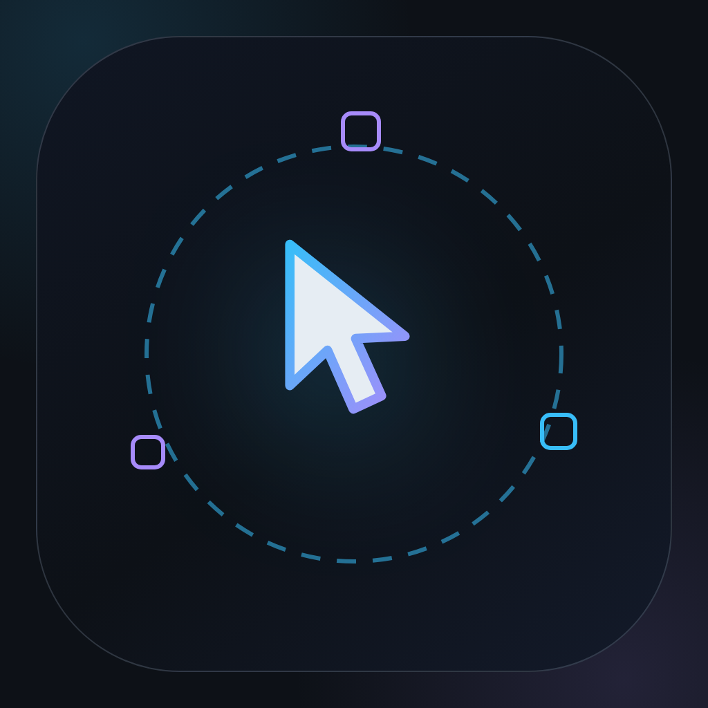
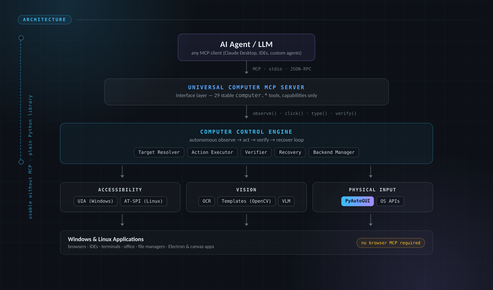
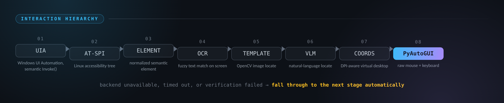
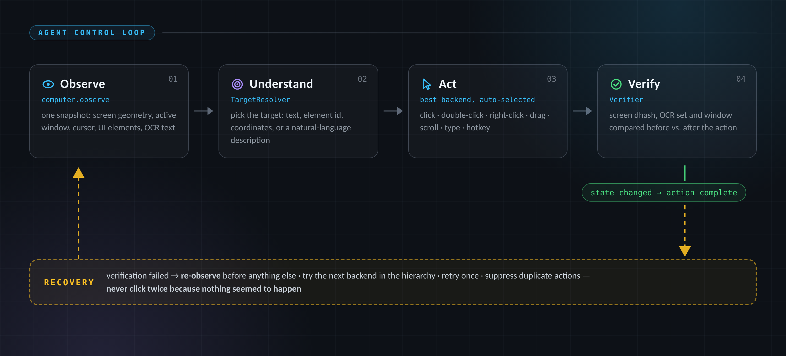

<p align="center">
  
</p>

# Universal Computer Control MCP

> **Give your AI agent eyes and hands on any computer.**
> Observe → understand → act → verify. No browser MCPs. No Playwright. Just real control.


A cross-platform **computer control MCP server** that lets an AI agent operate
a Windows or Linux computer like a human: *observe the screen → understand the
UI → choose an action → perform it → observe again → verify → recover if
needed*.

The system deliberately has **no dependency on Chrome MCP, browser MCP,
Playwright MCP or any other external MCP server**. Browsers, IDEs, office
suites, terminals, file managers, Electron apps and canvas-heavy applications
are all just GUI applications. Multiple backends live *inside* the server and
the best available mechanism is chosen automatically per action.

<p align="center">
  
</p>

```
                AI Agent / LLM
                       | MCP (stdio)
                       v
        +------------------------------+
        | Universal Computer MCP Server |
        +---------------+--------------+
                        v
        +------------------------------+
        |   Computer Control Engine    |  <- usable WITHOUT MCP
        +---------------+--------------+
            |            |             |
            v            v             v
     Accessibility   Vision/OCR    Physical Input
       Layer            Layer          Layer
      |      |         |      |       |       |
     UIA   AT-SPI     OCR  OpenCV   Mouse  Keyboard
    (Windows)(Linux) Tesseract  VLM  PyAutoGUI  OS APIs
```

## Highlights

- **29 stable MCP tools** under the `computer.` namespace — capabilities, not
  implementation details. No `pyautogui_click`, no `ocr_click`, no
  `playwright_click`.
- **Interaction hierarchy** per action: Windows UIA → Linux AT-SPI → semantic
  element → OCR text → image template → vision-language model → coordinates
  → PyAutoGUI. Every fallback is automatic.

<p align="center">
  
</p>

- **`computer.observe` is the core tool**: one structured snapshot with
  screen geometry, active window, cursor, OCR'd text and normalized UI
  elements (stable `element_N` ids within a cycle).

<p align="center">
  
</p>
- **Smart targets**: `computer.click("Continue")`, `computer.click("element_17")`,
  `computer.click({"x": 500, "y": 300})` — text matching is fuzzy
  (`"Continue"` matches `"continue"` and `"Continue →"`).
- **Verification & recovery**: before/after state comparison (screen dhash,
  OCR set, active window), strict mode that refuses silent no-ops, duplicate
  action suppression ("don't click twice because nothing seemed to happen"),
  ordered fallback attempts.
- **Graceful degradation**: missing UIA/AT-SPI/OCR/OpenCV/vision produce
  warnings, not crashes. PyAutoGUI alone = fully functional server.
- **Multi-monitor + DPI**: virtual-desktop coordinate space, per-monitor
  enumeration, Windows per-monitor-v2 DPI awareness.
- **Security**: permissive/standard/strict modes, command and application
  allowlists, rate limiting, confirmation gates for dangerous actions, safe
  logging (no passwords/tokens/clipboard contents), **global emergency stop**
  (tool + persistent stop-file).
- **Persistence**: `~/.universal-computer/` holds config, state, logs,
  screenshots, observations, sessions — independent of any MCP connection,
  with retention/cleanup.

## Requirements

| | Mandatory | Optional (recommended) |
|---|---|---|
| Python | 3.11+ | |
| Core | `mcp`, `pydantic`, `PyYAML`, `Pillow` | |
| Input | | `PyAutoGUI` (`[input]`) |
| Windows | | `pywinauto`, `pygetwindow`, `psutil` (`[windows]`) |
| Linux | | `psutil` (`[linux]`), system `wmctrl`, `xdotool`, `xclip` |
| Screenshots | | `mss` (`[screenshot]`), `scrot` on X11 |
| OCR | | `pytesseract` + system `tesseract-ocr` (`[ocr]`) |
| Vision | | `opencv-python`, `numpy` (`[vision]`) |
| VLM | | `httpx` (`[vlm]`) + an OpenAI-compatible endpoint |

## Installation

### Windows 10/11

```powershell
git clone https://github.com/adkdev200/universal-computer-control.git && cd universal-computer-control
powershell -ExecutionPolicy Bypass -File scripts\install_windows.ps1
```

Manual steps:

1. Install Python 3.11+ (`winget install -e --id Python.Python.3.12`), tick
   *Add to PATH*.
2. `python -m venv .venv && .venv\Scripts\pip install -e ".[input,windows,ocr,vision,screenshot,vlm]"`
3. Install Tesseract OCR: `winget install -e --id UB-Mannheim.TesseractOCR`
   (set `ocr.tesseract_cmd` in `config.yaml` if it is not on `PATH`).
4. Run: `.venv\Scripts\universal-computer-control` (alias: `.venv\Scripts\ucc`)

Windows UI Automation needs no extra permissions. If you run the server
elevated, non-elevated windows may refuse automation (UIA integrity levels).

### Linux (X11 or XWayland)

```bash
git clone https://github.com/adkdev200/universal-computer-control.git && cd universal-computer-control
bash scripts/install_linux.sh --yes     # add --no-sudo to skip system packages
./.venv/bin/ucc-doctor                  # verify every backend, exact fix hints
```

The installer is fully non-interactive with `--yes`: it installs system
packages (wmctrl/xdotool/xclip/scrot/tesseract/at-spi2-core), all Python
extras, and a ready `~/.universal-computer/config/config.yaml` with OCR,
template matching and the VLM provider enabled. `ucc-doctor` then probes every
backend live and prints copy-paste fix commands for anything missing. Note:
even on machines with **no** wmctrl/xdotool/xclip installed, the Linux window
backend now works through a built-in python-Xlib (EWMH/ICCCM) fallback - the
system tools only make it more robust.

Manual steps:

1. Python 3.11+ and system packages:

   ```bash
   sudo apt install python3 python3-venv python3-pip \
                    wmctrl xdotool xclip scrot \
                    tesseract-ocr at-spi2-core
   ```

2. `python3 -m venv .venv && ./.venv/bin/pip install -e ".[input,linux,ocr,vision,screenshot,vlm]"`
3. Run from a graphical session: `./.venv/bin/universal-computer-control` (alias: `./.venv/bin/ucc`)

**AT-SPI requirements** (accessibility): `at-spi2-core` must be running (it is
on desktop distros) and for GNOME/GTK apps enable
`gsettings set org.gnome.desktop.interface toolkit-accessibility true`.

**X11 vs Wayland**: X11 is fully supported. On Wayland-with-XWayland, input
and screenshots work through XWayland but foreign window management may be
restricted by the compositor. On pure Wayland (no `DISPLAY`), the window
backend disables itself with a warning; AT-SPI still works for cooperating
toolkits. See `docs/TROUBLESHOOTING.md`.

### Registering the server with an MCP client

`claude_desktop_config.json` (see `examples/mcp-config.example*.json`):

```json
{
  "mcpServers": {
    "universal-computer": {
      "command": "/absolute/path/to/universal-computer-control/.venv/bin/python",
      "args": ["-m", "universal_computer"],
      "env": {}
    }
  }
}
```

Any MCP client that speaks stdio works the same way. The engine is also a
plain library — no MCP required:

```python
from universal_computer import ComputerControlEngine, load_config

computer = ComputerControlEngine(load_config())
obs = await computer.observe("normal")
await computer.click("Continue")
await computer.type("hello")
```

## Tools (MCP API)

| Group | Tools |
|---|---|
| Observation | `computer.observe` (levels: minimal/normal/full) · `computer.screenshot` · `computer.get_ui_tree` · `computer.get_active_window` · `computer.find_text` · `computer.find_visual` · `computer.wait_for` |
| Mouse | `computer.click` · `computer.double_click` · `computer.right_click` · `computer.move_mouse` · `computer.drag` · `computer.scroll` |
| Keyboard | `computer.type` · `computer.press` · `computer.hotkey` |
| Windows | `computer.list_windows` · `computer.focus_window` · `computer.minimize_window` · `computer.maximize_window` · `computer.restore_window` · `computer.close_window` (needs `confirm=true`) |
| Clipboard | `computer.get_clipboard` · `computer.set_clipboard` |
| System | `computer.launch_application` · `computer.run_command` (allowlist + `confirm=true`) |
| Admin | `computer.backend_status` · `computer.emergency_stop` · `computer.reset_emergency_stop` |

`computer.observe` returns a normalized snapshot:

```json
{
  "ok": true,
  "id": "obs_17",
  "level": "normal",
  "screen": {"width": 1920, "height": 1080, "monitors": [...]},
  "active_window": {"title": "Google Chrome", "application": "chrome.exe", "process_id": 1234},
  "cursor": {"x": 812, "y": 530},
  "elements": [
    {"id": "element_1", "role": "button", "name": "Continue",
     "bbox": [1050, 700, 1170, 750], "source": "uia", "confidence": 0.99}
  ],
  "ocr": [
    {"text": "Continue", "bbox": [1050, 700, 1170, 750], "confidence": 0.97}
  ]
}
```

`computer.backend_status` reports per-backend health:

```json
{
  "pyautogui": {"available": true, "healthy": true},
  "uia":       {"available": true, "healthy": true},
  "atspi":     {"available": false, "healthy": false,
                "error": "pyatspi import failed (...); install python3-pyatspi"},
  "ocr":       {"available": true, "healthy": true}
}
```

## Configuration

`config.yaml` (see `config.example.yaml`) plus `UCC_` environment overrides
with `__` nesting:

```bash
UCC_ENGINE__VERIFICATION_MODE=strict
UCC_SECURITY__MODE=standard
UCC_SECURITY__ALLOWED_COMMANDS='["ls", "git status", "xdotool"]'
UCC_LOGGING__LEVEL=DEBUG
UCC_VISION__VLM__ENABLED=true
```

Configurable: observation level & caching, verification mode
(off/basic/strict), PyAutoGUI pauses/failsafe, OCR provider & language,
vision threshold, template directory, VLM endpoint (key read from the
environment variable named in `vision.vlm.api_key_env`), security mode,
allowlists, rate limits, timeouts, persistence retention, log levels and
per-backend priorities (`backends.priorities: {pyautogui: 5}`).

## Security model

| Mode | `run_command` | `launch_application` |
|---|---|---|
| `permissive` | allowed (still rate-limited) | allowed |
| `standard` (default) | requires `security.allowed_commands` **and** `confirm=true` | allowed unless a non-empty `allowed_applications` says otherwise |
| `strict` | only explicitly allowlisted; shell strings off unless `allow_shell` | exact allowlist match required |

Always on: rate limiting (`max_actions_per_minute`), command timeouts,
credential redaction in logs and command output, no clipboard/typed-text
logging, `close_window`/`run_command` confirmation gates, and the
**emergency stop** — `computer.emergency_stop()` halts every subsequent
action (checked before each attempt) and is persisted as a stop file so it
survives restarts and can be triggered externally.

## Extending

- **New OCR**: implement `universal_computer.vision.base.OCRProvider`
  (`detect_text(image) -> list[OCRResult]`) and register it in
  `VisionServices.from_config`.
- **New vision model**: implement `VisionLanguageModel.locate_element`
  (async, description → `VisionResult` with bbox). The OpenAI-compatible
  implementation shows the JSON contract.
- **New platform (macOS)**: subclass the `backends.base` ABCs
  (`InputBackend`, `ScreenshotBackend`, `AccessibilityBackend`,
  `WindowManagementBackend`, `ClipboardBackend`, `ApplicationBackend`) and
  register them in `core/bootstrap.py`. Nothing else changes — the engine
  only knows capabilities.
- **Template images**: put PNGs in `vision.template_dir`; refer to them by
  name from `computer.find_visual` or as click targets.

## Development

```bash
pip install -e ".[dev]"
pytest tests            # 160 unit + integration tests, no display needed
ruff check src tests
```

`scripts/e2e_live_test.py` is an end-to-end harness that boots its own
Xvfb + openbox session, creates real X11 windows, and exercises every
backend live (screenshots, OCR, window ops via both the tool paths and the
python-Xlib fallback, OpenCV template matching, the VLM pipeline against a
mock OpenAI-compatible endpoint, clipboard, input, launch, emergency stop):

```bash
python scripts/e2e_live_test.py             # full stack
python scripts/e2e_live_test.py --no-tools  # zero X11 tools: Xlib fallback
```

Unit tests run on any machine (OS-specific pieces are mocked). The
integration test boots the real server over stdio. See
`docs/ARCHITECTURE.md` for the module map and `docs/TROUBLESHOOTING.md` for
platform-specific fixes.
